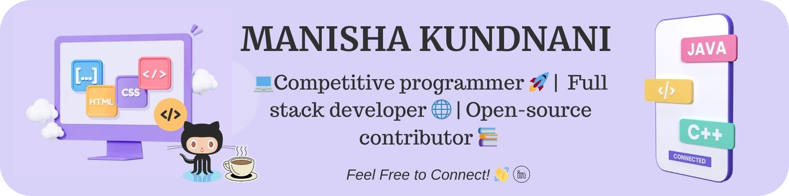
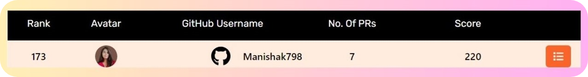

<h1 align="center" color="black">Hi 👋, I'm Manisha Kundnani</h1>
<h3 align="center">☕🚀 "Fueling my journey with strong coffee and 💻coding right beside me, every moment becomes a new and enriching learning experience." 🌟📚</h3>
 

  

 
<h3 align="left">Profile Views &#128064</h3>
  
<h3 align="left">About &#128173</h3>

-  🔭 I’m currently working on my **MERN stack skills!** 💻📘🚀

- 👯 I thrive in collaborative environments and seek opportunities to collaborate on exciting **Full stack development projects**. Let's join forces if you're passionate about impactful and innovative solutions! 🚀🤝 

- 💬 Feel free to pick my brain about anything related to **Full Stack development** and **Data Structures & Algorithms (DSA).** Whether it's architecting a dynamic web application or mastering the art of efficient algorithm design, I'm here to help. 🧠💻🌐 

- 📫 Whether you're interested in discussing potential collaborations, tech insights, or just want to say hi, you can contact me at **monakundnani113@gmail.com**. I'm always up for a good conversation! 📩👋
<h3 align="left">🏆 Achievements 🌟</h3>
<ul>
 <b>CP Rush 2.0 Coding Competition by Coding Ninjas🚀</b>
<li>🏅 AIR 35 out of 1122+ participants, Top 50.</li>
  
 <b>GSSOC'23 Contributor🚀</b>
<li>🏅 Ranked 173rd out of 1557 participants and 13000+ applicants, Top 200.</li>
  
 <b>Codeathon'23 - COTN2023 by Codechef🚀🌟</b>
 <li>Ranked 137 out of 600+ participants.🏅</li>
  
 <b>BCA Program Excellence 🎓</b>
 <li>🌟 Graduated in the Top 3% of the BCA Program,🥉 Secured 3rd position out of 120 Students in the BCA Program..</li>
</ul>
<h3 align="left">Open-Source Programs🌍</h3> 
<ul>

🌟<b>GirlScript Summer of Code (GSSOC)</b>🌈👩‍💻

<li>
My Standings: <b>Ranked 173🏆🚀</b>
</li>
<li>
Under <b>Top 200 Contributor</b> in GSSOC'23 out of <b>13000+</b> applicants.
</li>
 
</ul>
<h3 align="left">Let's Connect! 🤝 &#128279</h3>

  
 <h3 align="left">Coding Profiles💻🚀</h3>

<h3 align="left">Languages and Tools &#128187</h3>

              

<h3 align="left">Design Tools🎨</h3>

 

<h3 align="left">Let's Collaborate! 👥</h3>
<ul>
<li> 🚀 I'm open to collaborations on Full-stack projects 🌐, DSA problem-solving 👩‍💻, UI/UX design 🎨, and Open-source initiatives 🌟. Let's make magic happen! 🌈🤗</li>
 <li>Have an exciting project in mind? 🚀 Let's team up and create something great together. 💪🤝</li>
 
 <h3>   " Let's code, create, and conquer together! 🚀🌟 <b>Feel free to reach out! </b> 🌟"</h3>
 </ul>
<b>
</b>
<h3 align="left">My GitHub Stats 📊</h3>

&nbsp;

